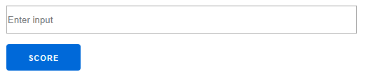
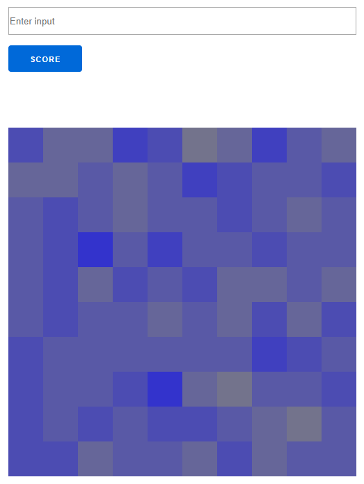
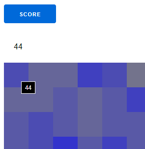

# SoilAnalysis

## Description of the project

NASA wishes to analyse soil on the surface of the planet Mars for the presence of water, using on-board instruments of the Curiosity rover.
The sensors on the rover output raw data which can visualised as a grid representing the concentration of water in soil sample at 2D (x,y) coordinates on a map.

The raw measurements will always range from 0 (no water detected) to 9 (lots of water detected).

This data is processed to find concentrated areas of water presence. The analysis consists of generating a score for each location on the grid.
The score is determined by adding the location's own raw water concentration value to its surrounding raw values. For instance, the score of location (1,1) in the following grid is determined as follows:

5 + 3 + 1 + 4 + 1 + 1 + 2 + 3 + 2 = 22

```
|---|---|---|---|---|
| 5 | 3 | 1 | 2 | 0 |
| 4 | 1 | 1 | 3 | 2 |
| 2 | 3 | 2 | 4 | 3 |
| 0 | 2 | 3 | 3 | 2 |
| 1 | 0 | 2 | 4 | 3 |
```

When dealing with locations around the edge of the grid the score ignores    values outside the grid. For instance the score of location (0,0) is as follows:

5 + 3 + 4 + 1 = 13

### Input and Output

The input provided to the sensor data processor is in the form of a list of numbers of the form: *t n Grid*

```
|---|---|---|---|---|---|---|---|---|---|---|
| 1 | 3 | 4 | 2 | 3 | 2 | 2 | 1 | 3 | 2 | 1 |
```

Where *t* is the number of results requested, *n* is the size of the grid and *grid* is a space delimited list of numbers that form the grid, starting with row 0.

The list of numbers above therefore represent a request for the single top score from a 3x3 grid that looks like so:


```
|---|---|---|
| 4 | 2 | 3 |
| 2 | 2 | 1 |
| 3 | 2 | 1 |
```

Output is a list of locations and their scores in the following form:

```
 (x, y, score: score)
```

i.e. the result that will be returned for the above input is:

```
 (1, 1, score: 20)
```


# SETUP

The project includes two applications:
- backend service scoring locations
- web interface (built on top of LiveView) that visualizes concentrations of water


```
cd apps/soil_analysis_heatmap
```


To start your Phoenix server:

  * Install dependencies with `mix deps.get`
  * Install Node.js dependencies with `cd assets && npm install`
  * Go back to the a level up :) `cd ..`
  * Start Phoenix endpoint with `mix phx.server`

Now you can visit [`localhost:4000/heatmap`](http://localhost:4000/heatmap) from your browser.

Web Interface is using LiveView to display results.

## Step



Put this into input field:

```
3 10 2 6 6 6 2 4 5 3 0 5 0 8 6 0 1 5 3 0 6 9 3 1 1 9 2 3 6 5 3 6 6 7 9 1 1 6 2 9 2 9 0 5 5 4 2 9 8 1 9 1 0 2 1 3 5 9 3 3 9 8 4 9 7 4 2 1 5 3 1 1 8 7 4 4 7 4 2 1 6 5 9 5 8 0 8 0 5 7 9 7 8 7 7 8 8 4 5 8 4 4
```

and click **Score**

You'll see a heat map where the darker color means higher concentration of water:



Clicking on cell will show the actual score:

